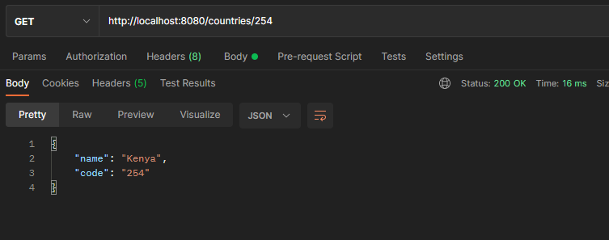

# Getting Started

### Overview

This is a RESTful web service application built using spring boot.

#### Libraries used

* [Spring Boot Starter Web](https://spring.io/guides/tutorials/rest/). Exposes the application as a web or web service. 
  [maven dependency](https://mvnrepository.com/artifact/org.springframework.boot/spring-boot-starter-web)
* [Lombok](https://projectlombok.org/). Assist in code generation to  minimizing boilerplate code. 
  [maven dependency](https://mvnrepository.com/artifact/org.projectlombok)
* [Spring Data JPA](https://spring.io/projects/spring-data-jpa).
  Help in managing relational data in spring application
  [maven dependency](https://mvnrepository.com/artifact/org.springframework.boot/spring-boot-starter-data-jpa)
* [H2](http://www.h2database.com/html/main.html).
  Embedded and open-source database that integrates well with Java language.
  Since it is in-memory database, it suits this situation.
  [maven dependency](https://mvnrepository.com/artifact/com.h2database/h2)
* [Spring Boot DevTools](https://docs.spring.io/spring-boot/docs/1.5.16.RELEASE/reference/html/using-boot-devtools.html).
    This helps in hot-reload when coding as you test the application.
  [maven dependency](https://mvnrepository.com/artifact/org.springframework.boot/spring-boot-devtools)

The application start by adding some seed data for each entity.

### Application endpoints
> #### Client
> ***GET***  
>  
http://localhost:8080/clients  
> Gives a list all clients  
> e.g  
> 
>   
> http://localhost:8080/clients/{id}  
> Returns the client whose id is as specified  
> e.g  
>    
> > ***POST***
>   
http://localhost:8080/clients  
> Adds a new client  
> e.g  
> 
> 
> > #### Branch
> ***GET***  
>  
http://localhost:8080/branches  
> Gives a list all country-branches  
> e.g  
> 
>   
> http://localhost:8080/branches/{id}  
> Returns the country-branch whose id is as specified  
> e.g  
>   
> ***POST***
>   
http://localhost:8080/branches  
> Adds a new country-branch  
> e.g  
> 
>
> > #### Device
> ***GET***  
>  
http://localhost:8080/devices  
> Gives a list all available devices  
> e.g  
> 
>   
> http://localhost:8080/devices/{serial}  
> Returns the device whose serial number is as specified  
> e.g  
>    
> > ***POST***
>   
http://localhost:8080/devices  
> Adds a new device  
> e.g  
> 

>
> > #### Country
> ***GET***  
>  
http://localhost:8080/countries  
> Gives a list all available countries  
> e.g  
> 
>   
> http://localhost:8080/countries/{code}  
> Returns the country whose code is as specified  
> e.g  
>   
> > ***POST***
>   
http://localhost:8080/countries  
> Adds a new country  
> e.g  
> 

### Why choose H2?
* H2 is a relational database as stated in the instructions.
* H2 is embedded database thus it runs on same JVM where the application is deployed.
* H2 has a small footprint. It won't significantly increase the size of the application bundle.
* H2 is witten in Java. Therefore, it integrates well with JVM languages. Also, it is automatically configured by spring boot application.
* H2 is in-memory which means it maintains the same size after application restart.

